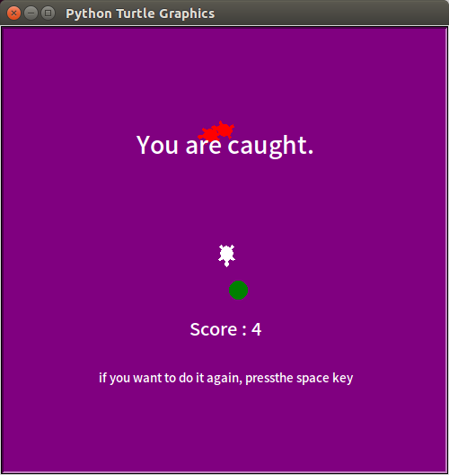

# Catch-a-turtle

### This game is a simple Python game.

When a user caught by a red turtle, user dies.
If you catch a green ball, user score increase.

The source is based on '모두의 파이썬'.
> https://thebook.io/006855/
