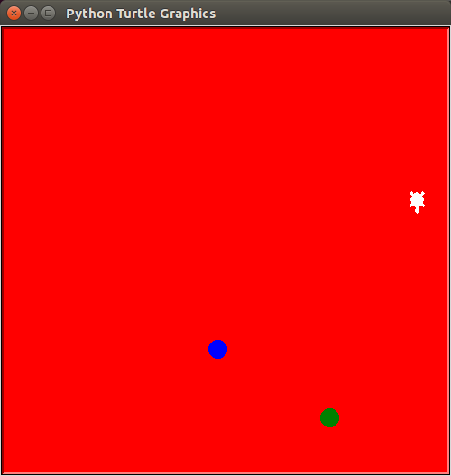
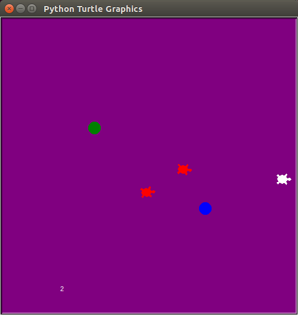

# Catch-a-turtle

### This game is a simple Python game.

  
>> Ubuntu users need these settings. : sudo apt-get install python3-tk

  
When a user caught by a red turtle, user dies.

 
If you catch a ball, user score increase.

But you catch a blue ball, the screen turns red.

Press the b button to use the booster as many times as the score.

As the score increases, the difficulty increases.

The source is based on '모두의 파이썬'.
> https://thebook.io/006855/
